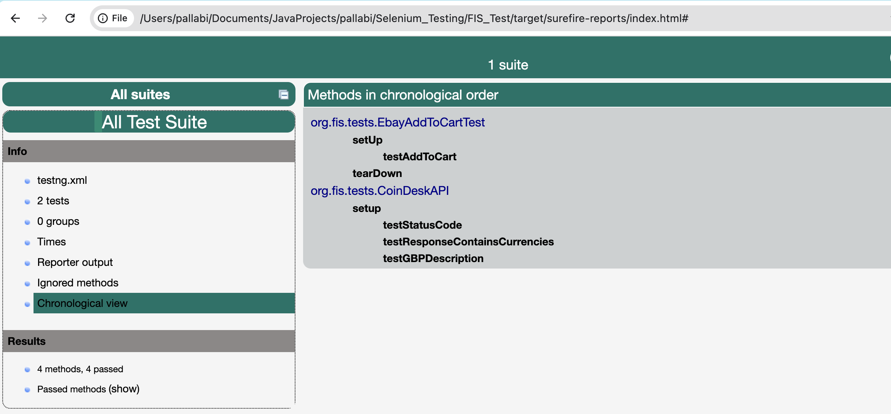

# API and UI Testing Framework

This repository contains the testing framework for both **API** and **UI** tests. It is designed to test the functionality of web services (API) and the front-end user interface (UI) of the application.
Below is the sample report generated :

## Generated Report




## Table of Contents

1. [Project Overview](#project-overview)
2. [Technology Stack](#technology-stack)
3. [API Testing](#api-testing)
4. [UI Testing](#ui-testing)
5. [Project Structure](#project-structure)

## Project Overview

This project aims to validate both backend API services and frontend UI functionality. It includes:

- **API Tests:** Verifying RESTful API endpoints for correct behavior, including response status, headers, and body content.
- **UI Tests:** Verifying the behavior of the user interface using a browser automation tool like Selenium.

## Technology Stack

- **Programming Language:** Java
- **API Testing Framework:** Rest Assured
- **UI Testing Framework:** Selenium WebDriver
- **Build Tool:** Maven
- **Test Reporting:** TestNG
- **Version Control:** Git

## API Testing

### Dependencies:
- **Rest Assured** for API interaction and validation.
- **TestNG** for organizing and executing tests.

### Test Example:
```java
// Sample API Test with Rest Assured
import io.restassured.RestAssured;
import io.restassured.response.Response;
import org.testng.Assert;
import org.testng.annotations.Test;

public class ApiTest {
    @Test
    public void verifyGetRequest() {
        Response response = RestAssured.get("https://api.example.com/endpoint");
        Assert.assertEquals(response.statusCode(), 200);
        Assert.assertTrue(response.body().asString().contains("expected data"));
    }
}
```

## UI Testing

### Dependencies:
- **Selenium WebDriver** for browser automation.
- **TestNG** for organizing and executing tests.

### Test Example:
```java
// Sample UI Test with Selenium WebDriver
import org.openqa.selenium.WebDriver;
import org.openqa.selenium.chrome.ChromeDriver;
import org.testng.Assert;
import org.testng.annotations.Test;

public class UiTest {
    @Test
    public void verifyHomePageTitle() {
        WebDriver driver = new ChromeDriver();
        driver.get("https://www.example.com");
        String pageTitle = driver.getTitle();
        Assert.assertEquals(pageTitle, "Expected Title");
        driver.quit();
    }
}
```

## Project Structure
```
/src
 /test
  /java
   /api
    ApiTest.java
   /ui
    UiTest.java
 /resources
  /config
   config.properties
```

